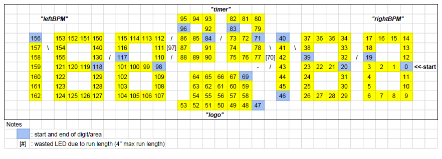

# Scoreboard

## MQTT Messages

The Scoreboard connects to the MQTT broker, and will reconnect every 500 ms if disconnected.

### Publishes

The Scoreboard announces itself every two seconds by way of a heartbeat, indicating the elapsed time in milliseconds since bootup.

* "asOne/score/heartbeat": current millis() every two seconds

### Subscribes

The Scoreboard subscribes to all topics within the "asOne/score" tree.

* "asOne/score/#": multi-level wildcard
	
### Processes

The Scoreboard processes the following topics.

* "asOne/score/state": [0,1,2] current state of the system
  * 0: idle/not playing.  scoreboard will mess around on its own.
  * 1: active/playing.  scoreboard will process the following subscriptions
  * 2: won/flames.  scoreboard will do some (garish) fanfare while the flames are shooting
* "asOne/score/logo": bytestream castable to CRGB, applied to all LEDs in logo
  * "asOne/score/logo/direct": bytestream castable to CRGB[22]
* "asOne/score/timer": [0-99] current timer to display on the countdown
  * "asOne/score/timer/direct: bytestream castable to CRGB[26]
* "asOne/score/leftBPM": [0-199] current heartrate to display on left score
  * "asOne/score/leftBPM/direct": bytestream castable to CRGB[47]
* "asOne/score/rightBPM": [0-199] current heartrate to display on right score
  * "asOne/score/rightBPM/direct": bytestream castable to CRGB[47]
  
## Physical Layout

### Scoreboard Diagram 

### Direct Addressing

The "asOne/score/*/direct" topics are CGRB arrays encoded as bytestreams.  

#### Logo

    const byte nLogoLED = 22;
    CRGB pixels[nLogoLED];
    fill_rainbow(pixels, nLogoLED, 0);
    mqtt.publish("asOne/score/logo/direct", (uint8_t *)pixels, sizeof(CRGB)*nLogoLED);

#### Timer

    const byte nTimerLED = 26;
    CRGB pixels[nTimerLED];
    fill_rainbow(pixels, nTimerLED, 0);
    mqtt.publish("asOne/score/timer/direct", (uint8_t *)pixels, sizeof(CRGB)*nTimerLED);

#### leftBPM

    const byte nBPMLED = 47;
    CRGB pixels[nBPMLED];
    fill_rainbow(pixels, nBPMLED, 0);
    mqtt.publish("asOne/score/leftBPM/direct", (uint8_t *)pixels, sizeof(CRGB)*nBPMLED);

#### rightBPM

    const byte nBPMLED = 47;
    CRGB pixels[nBPMLED];
    fill_rainbow(pixels, nBPMLED, 0);
    mqtt.publish("asOne/score/rightBPM/direct", (uint8_t *)pixels, sizeof(CRGB)*nBPMLED);

